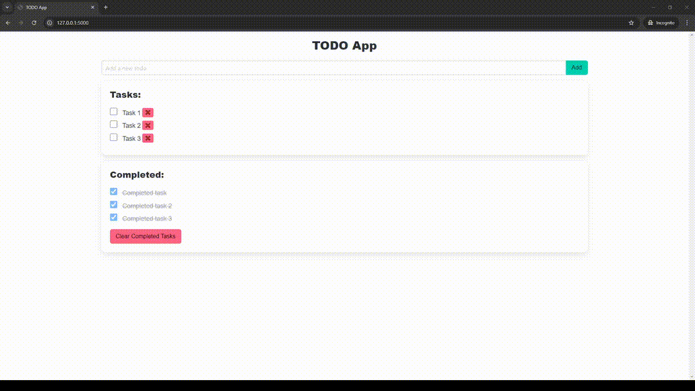

# 📝 **Flask TODO CRUD App** 📝

## Project Overview

A basic TODO application built with Flask for the backend, jQuery for interactivity, and Bulma for styling. Users can create, read, update, and delete TODO items.

## Prerequisites
- **Python 3.x**: Install [Python 3.x](https://www.python.org/downloads/).
- **Flask**: Install Flask using pip.

## Building and Running

1. **Clone the repository**:
   ```bash
   git clone https://github.com/GitEagleY/TODO_Flask.git
   cd TODO_Flask
   ```

2. **Create a virtual environment**:
   ```bash
   python -m venv venv
   source venv/bin/activate    # On Unix
   venv\Scripts\activate        # On Windows
   ```

3. **Install dependencies**:
   ```bash
   pip install -r requirements.txt
   ```

4. **Run the app**:
   ```bash
   flask run
   ```

5. **Access the app**:
   Navigate to `http://127.0.0.1:5000/` in your browser.

## Technologies Used
- **Backend**: Flask (Python)
- **Frontend**: jQuery, Bulma (CSS framework)

## Folder Structure
```
/app.py        # Main Flask app, contains the core logic, routes, and server configuration for the application
/templates     # HTML templates for the UI
/static        # Static files like CSS and JS
/venv          # Virtual environment
/.env          # Environment variables (optional)
/instance      # Holds instance-specific data, like configuration or the SQLite database (e.g., `todo.db` for storing app data)

```

## Contributions
Feel free to fork the repository, create a feature branch, and submit a pull request!

